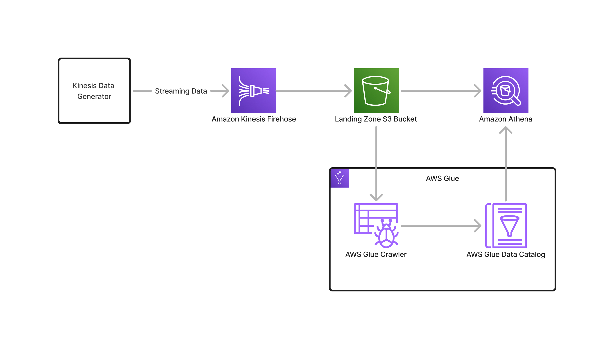

# Amazon Kinesis Firehose Streaming Data Setup

This repository contains the necessary configurations and code to set up an streaming data ingestion using Amazon Kinesis Firehose. This setup will also allow you to run ad hoc SQL queries on the data using Amazon Athena.

This is a supporting material to my blog post entitled, Ingest and Query Streaming Data with Amazon Kinesis Firehose and Amazon Athena.